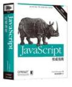

## Javascrpit 学习笔记
  JavaScript权威指南(第6版)中文版读书笔记
  
### 4.表达式和运算符
 
### 5.语句

### 6.对象
    
### 7.数组

### 8.函数

### 9.类和模块

### 10.正则表达式

### 13.WEB浏览器中javascript

### 22.HTML5 API

## 推荐数据购买地址

  http://product.dangdang.com/22722790.html
  